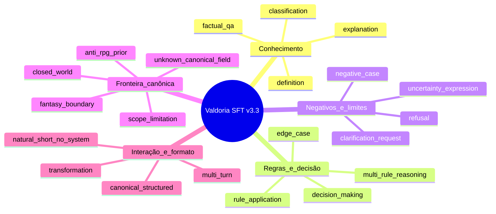

```mermaid
mindmap
  root((Valdoria SFT v3.3))
    Conhecimento
      factual_qa
      definition
      explanation
      classification
    Regras_e_decisão
      rule_application
      multi_rule_reasoning
      decision_making
      edge_case
    Negativos_e_limites
      negative_case
      refusal
      clarification_request
      uncertainty_expression
    Fronteira_canônica
      fantasy_boundary
      unknown_canonical_field
      scope_limitation
      closed_world
      anti_rpg_prior
    Interação_e_formato
      transformation
      multi_turn
      canonical_structured
      natural_short_no_system
```
