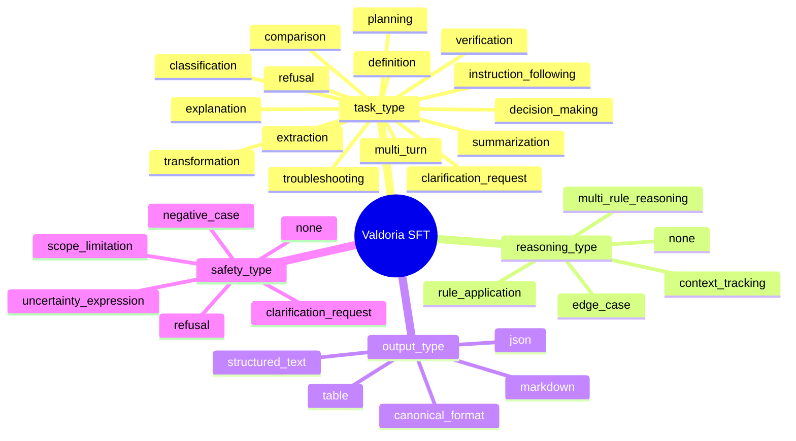

# Taxonomia Mermaid

```mermaid
mindmap
  root((Valdoria SFT))
    task_type
      definition
      explanation
      comparison
      classification
      extraction
      summarization
      transformation
      verification
      decision_making
      planning
      troubleshooting
      instruction_following
      refusal
      clarification_request
      multi_turn
    reasoning_type
      none
      rule_application
      multi_rule_reasoning
      edge_case
      context_tracking
    output_type
      structured_text
      canonical_format
      json
      markdown
      table
    safety_type
      none
      negative_case
      refusal
      scope_limitation
      uncertainty_expression
      clarification_request
```
